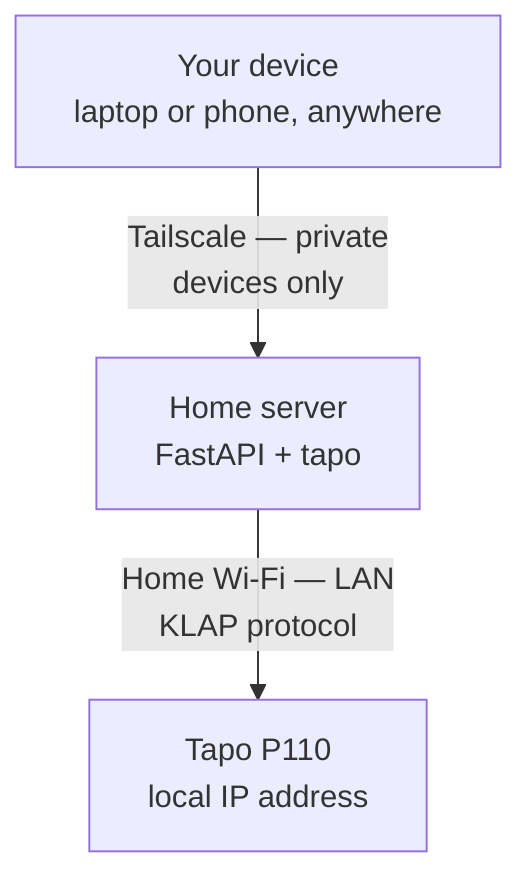
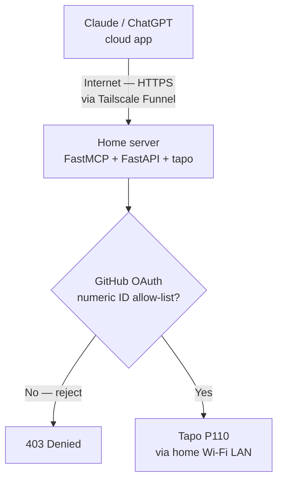
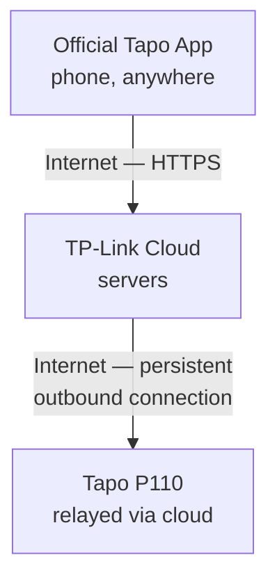

# Remote Access Architecture — Web App, AI Agent (MCP), and the Official Tapo Path

Three separate ways the plug ends up getting controlled, and how each one reaches it.
Two of these (Web App, AI Agent) are paths *we* build and control. The third
(Official Tapo App) is TP-Link's own cloud path, shown here only for contrast —
it's not part of our system, and it's the exact approach we evaluated and
deliberately moved away from earlier in this project.

---

## 1. Web application path — private, Tailscale only

This is the path already built and working: any device joined to the
Tailscale tailnet (your laptop, your future phone) reaches the home server
privately, and the home server talks to the plug over the local Wi-Fi LAN.
Nothing here is reachable from the public internet.



**Exposure:** none. Only devices logged into your own Tailscale account can
reach the home server at all.

---

## 2. AI agent path — public, OAuth-gated, via Tailscale Funnel

This is the new path for Claude (or any MCP-compatible AI client) to control
the plug. Claude's cloud app can't reach a private tailnet — it needs a real,
public HTTPS URL. Tailscale Funnel exposes **one specific port** on the same
home server to the public internet, while everything else on that device
(including the plug-facing internals) stays private. GitHub OAuth gates entry
to that port, and an explicit allow-list inside the server rejects anyone who
isn't you, even if they complete OAuth successfully.



**Exposure:** exactly one port, publicly reachable, but every request must
first complete GitHub OAuth *and* match the allow-listed immutable numeric
GitHub user ID before any tool call reaches the plug. Everything else on the
home server (the web app,
the plug-control internals) is not exposed by this path — Funnel only
publishes the single port the MCP server listens on.

**Why this and not a custom chatbot:** Claude's own app is already the
conversational interface — the MCP server just needs to exist and be
reachable. No separate bot to build or host.

**Why this and not Cloudflare Workers:** Cloudflare's Workers + OAuth-provider
pattern is a legitimate alternative, but it means porting the MCP logic into
a serverless environment that can't reach the home LAN on its own — requiring
a *second* system (Cloudflare Tunnel) just to bridge back home. Tailscale
Funnel gives the same "controlled public exposure" using infrastructure
already running on the same device, in the same Python stack as everything
else in this project.

---

## 3. Official Tapo app path — TP-Link's cloud (not our system)

Shown for contrast. This is how the plug is controlled from anywhere using
the stock Tapo app, with zero infrastructure of our own — because the plug
itself maintains a persistent outbound connection to TP-Link's cloud at all
times, and the app talks to that cloud, not to the plug directly.



**Why we're not using this path:** this is exactly the approach tried early
in the project via `tplink-cloud-api` — login worked, but toggle commands
silently failed with no error, a known unresolved issue tied to this specific
protocol (KLAP/TPAP) not being supported by that library. TP-Link's own cloud
protocol for the P110 hasn't been reverse-engineered by the open-source
tooling we're using, so this path is unavailable to us even though it's how
the official app works.

---

## Exposure comparison

| Path | Reachable from | Auth | What's exposed |
|---|---|---|---|
| Web app | Only your own Tailscale devices | Tailscale device login (implicit) | Nothing public |
| AI agent (MCP) | Anywhere on the internet | GitHub OAuth + numeric-ID allow-list | One port only, gated |
| Official Tapo app | Anywhere on the internet | TP-Link account login | Entire cloud-relay path (TP-Link's infrastructure, not ours) |

## Security notes for the AI agent path

- Tailscale's own documentation is explicit that Funnel exposes the local
  port to the public internet and anyone with the URL can reach it — the
  OAuth + allow-list layer is what keeps this safe, not the URL being secret.
- `GitHubProvider`'s default behavior only confirms "this is a genuine
  GitHub-authenticated user" — it does **not** restrict to a specific person.
  The allow-list check compares GitHub's immutable numeric user ID on every
  tool call. Usernames are deliberately not used for authorization.
- Only the MCP server's port should be handed to Funnel — the plug-control
  internals and the web app should stay on ports that are never passed to
  `tailscale funnel`, keeping them private even though the device itself has
  one public-facing port.

## MCP setup

Create a GitHub OAuth App with this callback URL, where the port and hostname
match the public MCP URL:

```text
https://mcp.example.com/auth/callback
```

Set these values in the ignored `.env` file:

```text
GITHUB_CLIENT_ID=...
GITHUB_CLIENT_SECRET=...
ALLOWED_GITHUB_USER_ID=12345678
MCP_PUBLIC_BASE_URL=https://mcp.example.com
MCP_JWT_SIGNING_KEY=use-a-long-random-secret
MCP_HOST=127.0.0.1
MCP_PORT=8765
```

Start the server with `home-automation-mcp`. Funnel **only** the MCP port;
never pass the web application's port or any other internal port to Funnel:

```powershell
tailscale funnel --bg 8765
```

The existing Tailscale-only web application path is unaffected and remains the
primary and fallback control path.
